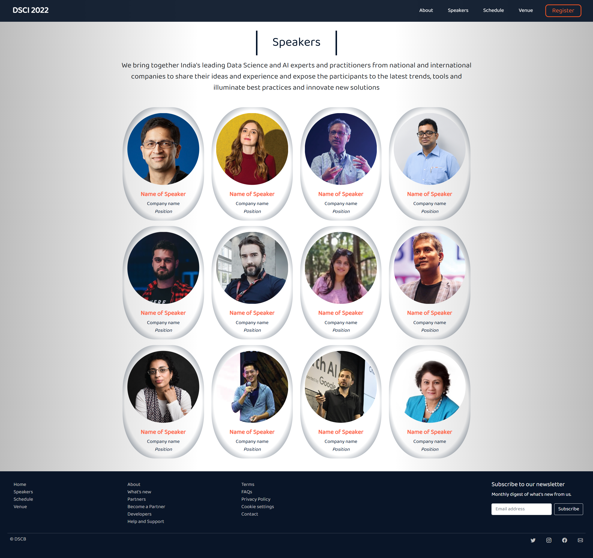
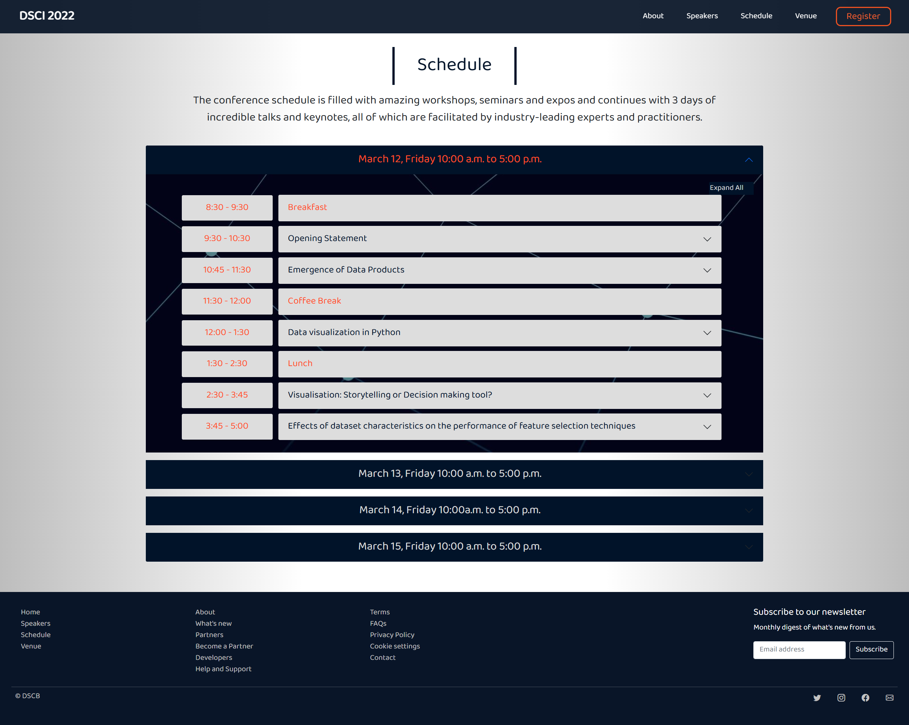
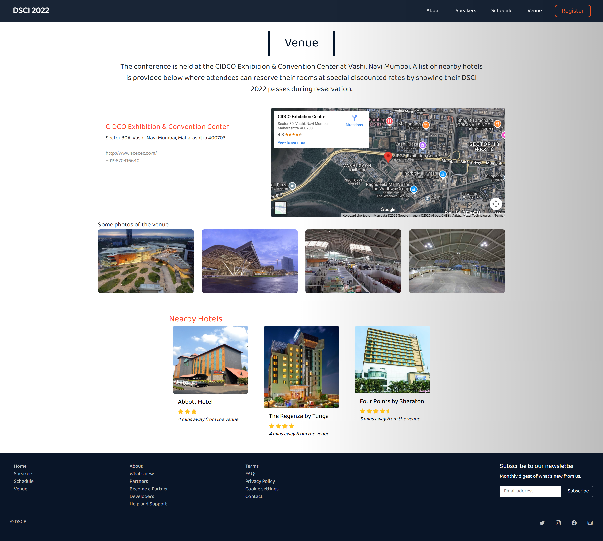
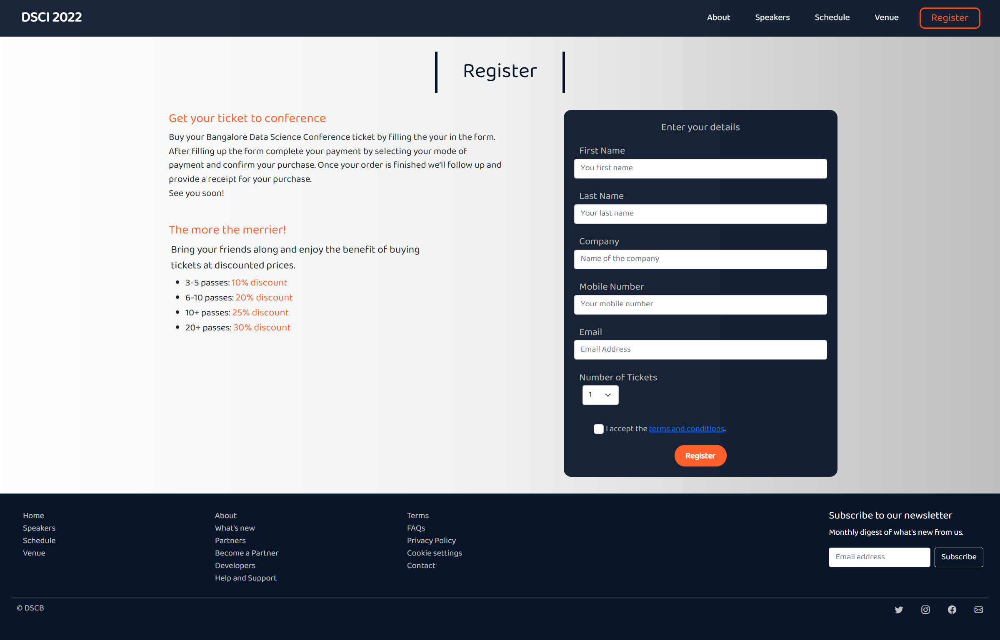

# Data Science Conference Website Template

A **fully responsive** and modern website template built for promoting **Data Science & AI conferences** using HTML5, CSS3, and Bootstrap.  
Includes dedicated sections for speaker profiles, event agenda, registration, and venue details, improving informational clarity and usability.

Enhanced technical proficiency in web technologies, boosting confidence in delivering polished UI components and layouts.

Designed in **2022** during my postgraduate studies as a part of my Semester 3 project, now hosted live for portfolio purposes.  

---

## Preview Screens
Here are some screeshots of the website template:  

1. Landing Page

2. About Page

3. Speakers Page

4. Schedule Page

5. Venue Page

6. Register Page

---

## Links
You can view the Website template here
* Website - **[Live Demo](https://aliya-fanaskar.github.io/Data-Science-Conference-Website-Template/Code_files)**  
* Source Code - **[Source Code](https://github.com/aliya-fanaskar/Data-Science-Conference-Website-Template/tree/main/Code_files)**

---

## Tech Stack
- HTML5  
- CSS3  
- Bootstrap 4  
- Custom CSS Styling  

---

#### Aliya Fanaskar: www.linkedin.com/in/aliya-adil99
